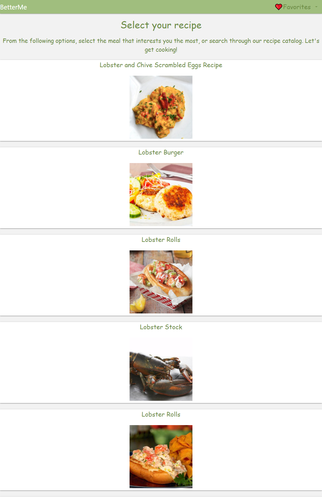
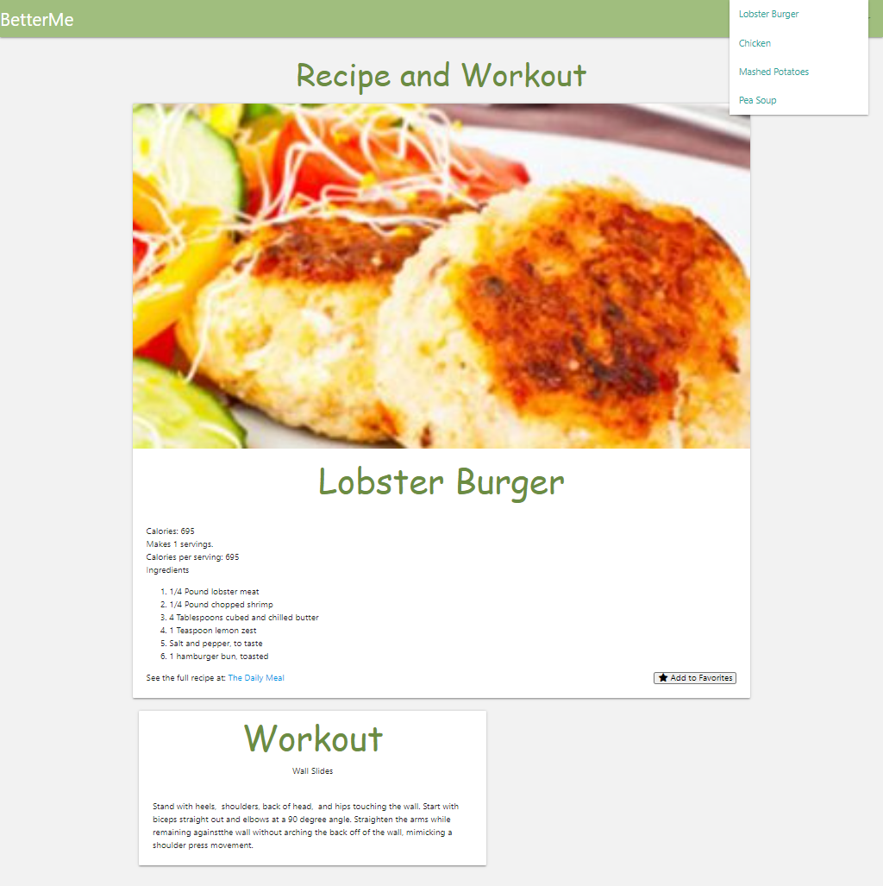

# 🍽BetterMe

### [CLICK HERE TO VIEW LIVE SITE](https://kevinconnell96.github.io/BetterMe/) 

## User Story
```
I am a busy individual with dieting restrictions and fluctuating fitness levels.
I want to increase my overall health and wellness. 
I'm looking for recipes based on my dieting preferences that I can reference at any time.
I also want suggested workouts based on my activity level that pairs well with my meals.
```

## Application Description

A recipe and fitness application built for users of all health and fitness levels. 
The user can search for or filter based on his or her dieting restrictions and recipes are generated from the user's selections. Workouts are tailored and determined by the user's activity level marked. 
The user can favorite recipes and revisit those meals at any time using the favorite recipes drop down menu. 

## Functionality 


## Screenshots 






## Built With
- [Materialize](https://materializecss.com/) 
- [Edamam API](https://developer.edamam.com/edamam-docs-recipe-api) 
- [wger API](https://wger.de/en/software/api) 
